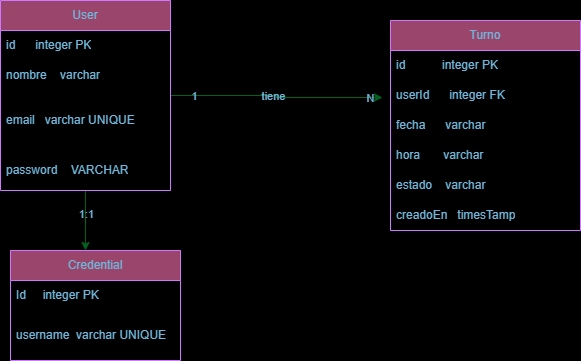

# MediTom 🏥

Sistema de gestión de turnos médicos — aplicación full stack con autenticación JWT y base de datos PostgreSQL.

---

## Descripción

MediTom permite a los pacientes registrarse, iniciar sesión y gestionar sus citas médicas de forma online. Los usuarios pueden agendar turnos, consultar su historial y cancelar citas desde cualquier dispositivo.

---

## Tecnologías

### Backend
| Tecnología | Versión | Uso |
|---|---|---|
| Node.js | - | Entorno de ejecución |
| TypeScript | 5.9 | Lenguaje principal |
| Express | 5.2 | Framework HTTP |
| TypeORM | 0.3 | ORM para PostgreSQL |
| PostgreSQL | 18 | Base de datos |
| bcryptjs | 3.0 | Hashing de contraseñas |
| jsonwebtoken | 9.0 | Autenticación JWT |
| morgan | 1.10 | Logger de requests |

### Frontend
| Tecnología | Versión | Uso |
|---|---|---|
| React | 19 | Librería UI |
| Vite | 7 | Bundler |
| Tailwind CSS | 3.4 | Estilos |
| React Router DOM | 7 | Navegación |
| Axios | 1.13 | Peticiones HTTP |
| Framer Motion | 12 | Animaciones |
| Lucide React | 0.577 | Iconos |
| SweetAlert2 | 11 | Alertas |

---

## Estructura del proyecto

```
PM3-SarhenRamirez/
├── back/
│   └── src/
│       ├── config/
│       │   └── envs.ts
│       ├── controllers/
│       │   ├── auth.controller.ts
│       │   └── turnos.controller.ts
│       ├── data/
│       │   └── app.datasource.ts
│       ├── entities/
│       │   ├── Credential.ts
│       │   ├── Turno.ts
│       │   └── User.ts
│       ├── middleware/
│       │   ├── auth.ts
│       │   └── error.middleware.ts
│       ├── routes/
│       │   ├── auth.routes.ts
│       │   ├── turnos.routes.ts
│       │   └── usuarios.routes.ts
│       ├── services/
│       │   └── turnos.service.ts
│       ├── types/
│       │   └── express/index.d.ts
│       └── server.ts
├── front/
│   └── src/
│       ├── components/
│       │   ├── Layout.jsx
│       │   ├── Loader.jsx
│       │   ├── Navbar.jsx
│       │   └── ProtectedRoute.jsx
│       ├── context/
│       │   ├── TurnosContext.jsx
│       │   └── UserContext.jsx
│       ├── services/
│       │   └── api.js
│       └── views/
│           ├── Home.jsx
│           ├── Login.jsx
│           ├── MisTurnos.jsx
│           ├── NuevoTurno.jsx
│           ├── Perfil.jsx
│           └── Register.jsx
└── docs/
    └── diagrama-er.png
```

---

## Instalación y configuración

### Requisitos previos

- Node.js 18+
- PostgreSQL 14+
- npm

### 1. Clonar el repositorio

```bash
git clone <https://github.com/SarhenRamirez/PM3-SarhenRamirez.git>
cd PM3-SarhenRamirez
```

### 2. Configurar el backend

```bash
cd back
npm install
```

Crear el archivo `.env` en la carpeta `back/` con las siguientes variables:

```env
PORT=3000

DB_HOST=localhost
DB_PORT=5432
DB_USER=postgres
DB_PASSWORD=tu_password
DB_NAME=meditom

JWT_SECRET=una_clave_secreta_larga
```

### 3. Crear la base de datos

```bash
psql -U postgres -c "CREATE DATABASE meditom;"
```

### 4. Configurar el frontend

```bash
cd ../front
npm install
```

---

## Ejecución

### Backend

```bash
cd back
npm run dev
```

El servidor corre en `http://localhost:3000`

### Frontend

```bash
cd front
npm run dev
```

La aplicación corre en `http://localhost:5173`

---

## Endpoints de la API

### Autenticación

| Método | Endpoint | Auth | Descripción |
|---|---|---|---|
| POST | `/api/auth/register` | No | Registrar usuario |
| POST | `/api/auth/login` | No | Iniciar sesión — devuelve JWT |

### Turnos

| Método | Endpoint | Auth | Descripción |
|---|---|---|---|
| POST | `/api/turnos` | JWT | Crear turno |
| GET | `/api/turnos/mis-turnos` | JWT | Obtener turnos del usuario |
| GET | `/api/turnos/:id` | JWT | Obtener turno por ID |
| PATCH | `/api/turnos/:id/cancelar` | JWT | Cancelar turno |

### Usuarios

| Método | Endpoint | Auth | Descripción |
|---|---|---|---|
| GET | `/api/usuarios/perfil` | JWT | Ver perfil del usuario logueado |

---

## Modelo de datos



### User
| Campo | Tipo | Descripción |
|---|---|---|
| id | integer PK | Identificador único |
| nombre | varchar | Nombre del usuario |
| email | varchar UNIQUE | Email — usado para login |
| password | varchar | Contraseña hasheada con bcrypt |

### Turno
| Campo | Tipo | Descripción |
|---|---|---|
| id | integer PK | Identificador único |
| userId | integer FK | Referencia al usuario dueño |
| fecha | varchar | Fecha en formato YYYY-MM-DD |
| hora | varchar | Hora en formato HH:mm |
| estado | varchar | `agendado` o `cancelado` |
| creadoEn | timestamp | Fecha de creación del registro |

### Credential
| Campo | Tipo | Descripción |
|---|---|---|
| id | integer PK | Identificador único |
| username | varchar UNIQUE | Nombre de usuario |

---

## Reglas de negocio

- Solo se pueden agendar turnos a partir del día siguiente
- No se permiten turnos en fines de semana
- El horario disponible es de 06:00 a 17:00
- No puede haber dos turnos en el mismo horario
- Solo el dueño del turno puede cancelarlo
- No se pueden cancelar turnos de fechas pasadas

---

## Autenticación

El sistema usa **JSON Web Tokens (JWT)**. Al hacer login se devuelve un token que debe enviarse en el header de cada petición protegida:

```
Authorization: Bearer <token>
```

El token expira en 24 horas.

---

## Scripts disponibles

### Backend

| Script | Descripción |
|---|---|
| `npm run dev` | Inicia el servidor en modo desarrollo con nodemon |
| `npm run build` | Compila TypeScript a JavaScript |
| `npm start` | Inicia el servidor compilado en producción |

### Frontend

| Script | Descripción |
|---|---|
| `npm run dev` | Inicia Vite en modo desarrollo |
| `npm run build` | Genera el build de producción |
| `npm run preview` | Previsualiza el build de producción |
| `npm run lint` | Ejecuta ESLint |

---

## Autor

Desarrollado por **Sarhen Ramirez** — Proyecto PM3